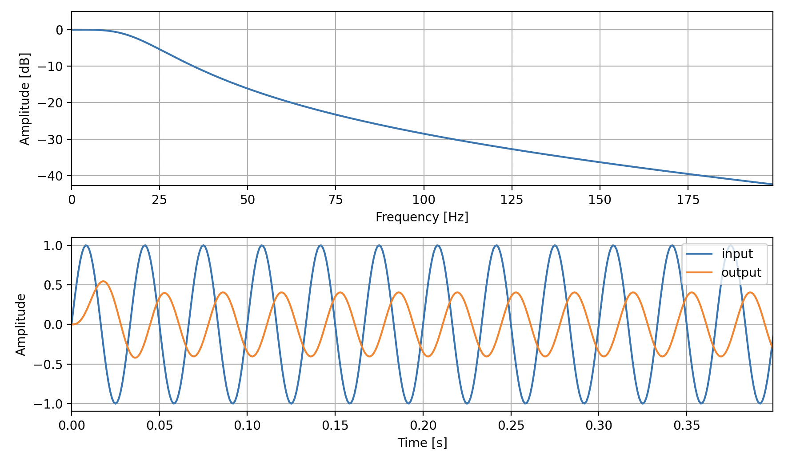
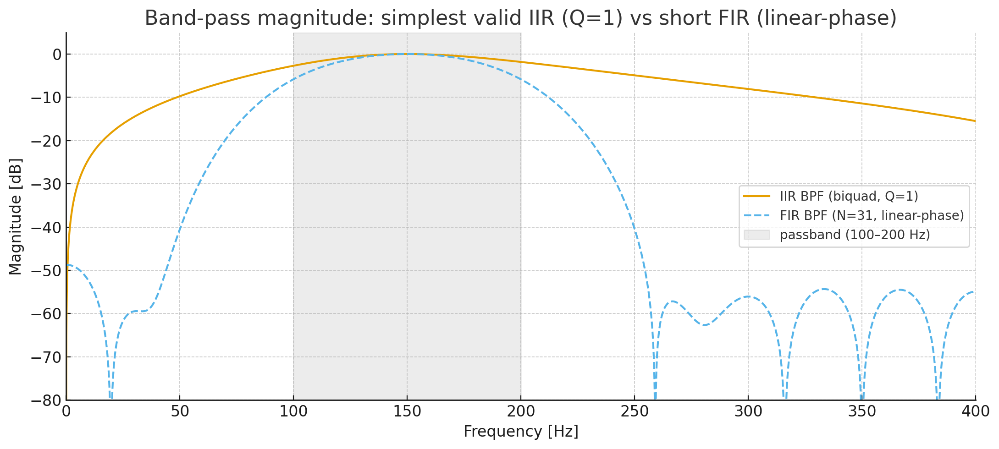
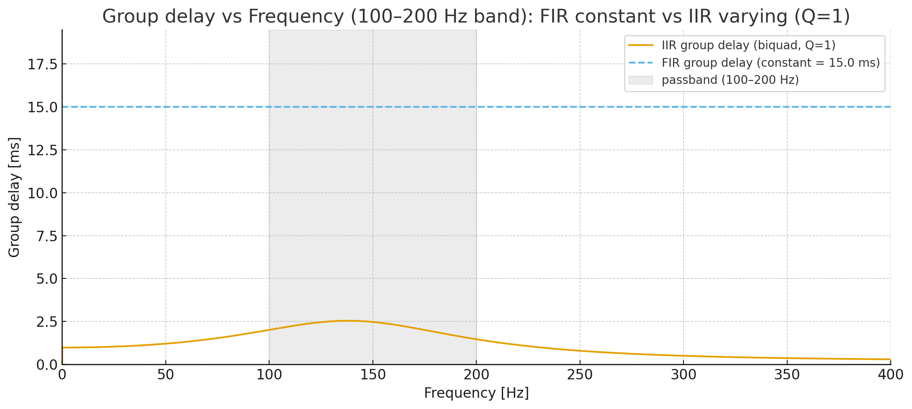
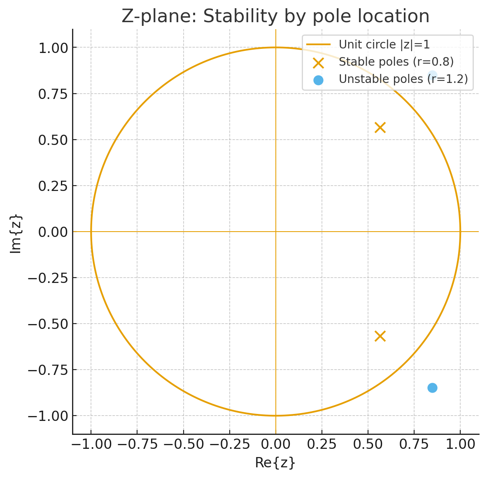
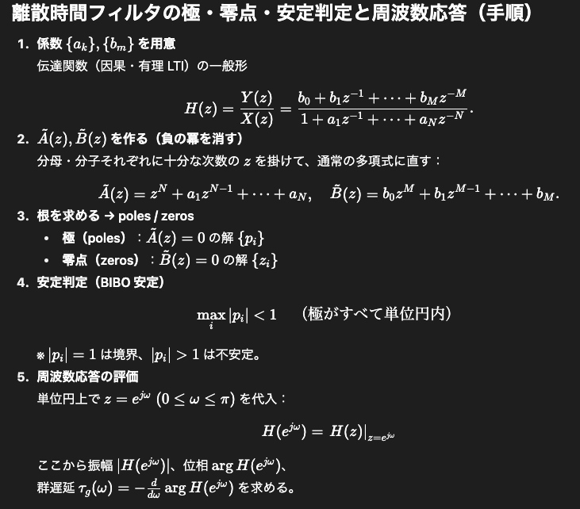
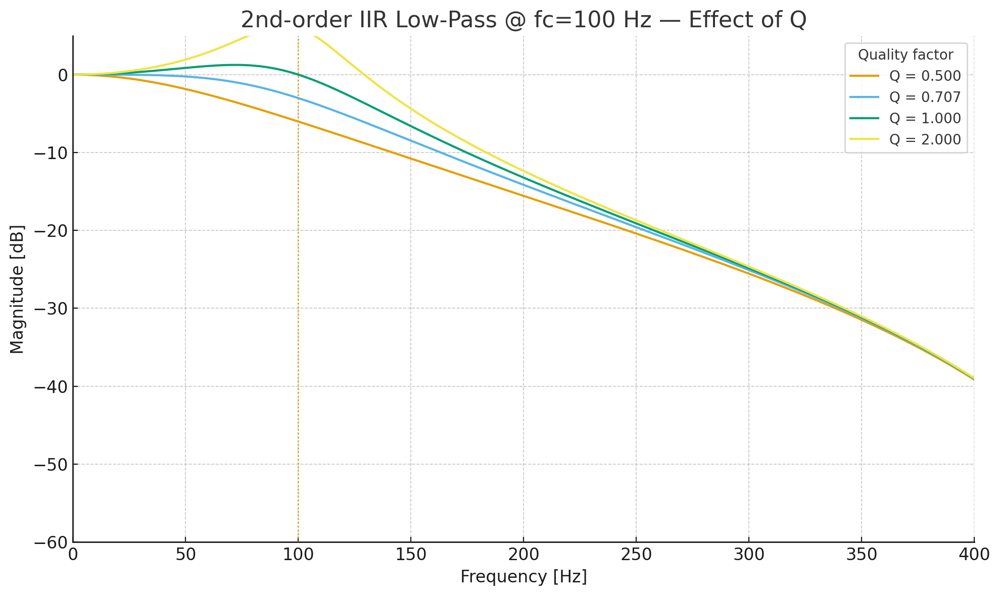
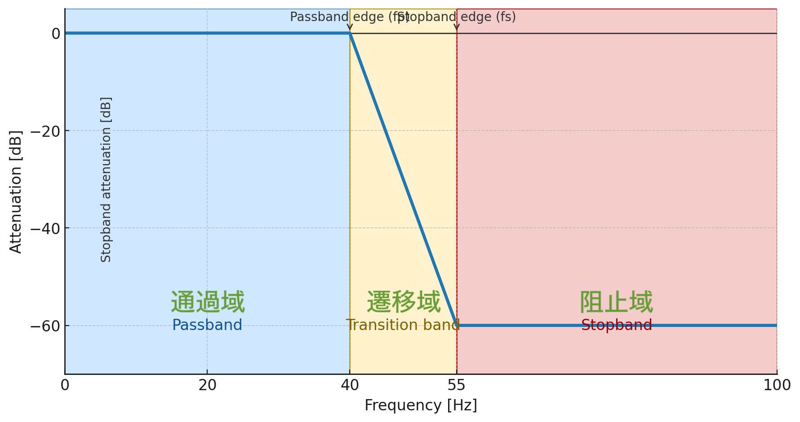

# デジタルフィルタ設計 1章

<!-- TOC -->

- [デジタルフィルタ設計 1章](#%E3%83%87%E3%82%B8%E3%82%BF%E3%83%AB%E3%83%95%E3%82%A3%E3%83%AB%E3%82%BF%E8%A8%AD%E8%A8%88-1%E7%AB%A0)
    - [前書き](#%E5%89%8D%E6%9B%B8%E3%81%8D)
    - [デジタルフィルタの種類](#%E3%83%87%E3%82%B8%E3%82%BF%E3%83%AB%E3%83%95%E3%82%A3%E3%83%AB%E3%82%BF%E3%81%AE%E7%A8%AE%E9%A1%9E)
    - [デジタルフィルタのグラフの見方](#%E3%83%87%E3%82%B8%E3%82%BF%E3%83%AB%E3%83%95%E3%82%A3%E3%83%AB%E3%82%BF%E3%81%AE%E3%82%B0%E3%83%A9%E3%83%95%E3%81%AE%E8%A6%8B%E6%96%B9)
    - [デジタルフィルタの構造と特徴](#%E3%83%87%E3%82%B8%E3%82%BF%E3%83%AB%E3%83%95%E3%82%A3%E3%83%AB%E3%82%BF%E3%81%AE%E6%A7%8B%E9%80%A0%E3%81%A8%E7%89%B9%E5%BE%B4)
        - [構造](#%E6%A7%8B%E9%80%A0)
        - [特徴](#%E7%89%B9%E5%BE%B4)
            - [位相特性](#%E4%BD%8D%E7%9B%B8%E7%89%B9%E6%80%A7)
            - [安定性](#%E5%AE%89%E5%AE%9A%E6%80%A7)
            - [Q（共振の鋭さ）](#q%E5%85%B1%E6%8C%AF%E3%81%AE%E9%8B%AD%E3%81%95)
            - [周波数応答性遷移域の狭さ](#%E5%91%A8%E6%B3%A2%E6%95%B0%E5%BF%9C%E7%AD%94%E6%80%A7%E9%81%B7%E7%A7%BB%E5%9F%9F%E3%81%AE%E7%8B%AD%E3%81%95)
            - [計算量（リアルタイム適性）](#%E8%A8%88%E7%AE%97%E9%87%8F%E3%83%AA%E3%82%A2%E3%83%AB%E3%82%BF%E3%82%A4%E3%83%A0%E9%81%A9%E6%80%A7)
            - [特徴まとめ](#%E7%89%B9%E5%BE%B4%E3%81%BE%E3%81%A8%E3%82%81)
    - [設計法の選択](#%E8%A8%AD%E8%A8%88%E6%B3%95%E3%81%AE%E9%81%B8%E6%8A%9E)
        - [IIR の代表例](#iir-%E3%81%AE%E4%BB%A3%E8%A1%A8%E4%BE%8B)
        - [FIR の代表例](#fir-%E3%81%AE%E4%BB%A3%E8%A1%A8%E4%BE%8B)
    - [デジタルフィルタの設計手順](#%E3%83%87%E3%82%B8%E3%82%BF%E3%83%AB%E3%83%95%E3%82%A3%E3%83%AB%E3%82%BF%E3%81%AE%E8%A8%AD%E8%A8%88%E6%89%8B%E9%A0%86)
        - [FIR フィルタ](#fir-%E3%83%95%E3%82%A3%E3%83%AB%E3%82%BF)
        - [IIR フィルタ](#iir-%E3%83%95%E3%82%A3%E3%83%AB%E3%82%BF)
    - [コメント](#%E3%82%B3%E3%83%A1%E3%83%B3%E3%83%88)
    - [参考文献](#%E5%8F%82%E8%80%83%E6%96%87%E7%8C%AE)

<!-- /TOC -->

## 前書き
研究で用いるデジタルフィルタを実際に設計する際に必要な知識を整理したページです。内容に不備があればご指摘ください。 

---

## デジタルフィルタの種類
* **LPF（ローパスフィルタ）**  
  低周波を通し、高周波を減衰させる。
* **HPF（ハイパスフィルタ）**  
  高周波を通し、低周波を減衰させる。
* **BPF（バンドパスフィルタ）**  
  〇〇Hz〜△△Hzの帯域のみ通し、それ以外を減衰させる。
* **ノッチ（バンドストップ）フィルタ**  
  ◻︎◻︎Hz付近のみ減衰させ、それ以外を通す。

---

## デジタルフィルタのグラフの見方
図1上は周波数特性（縦軸：利得[dB]、横軸：周波数[Hz]）です。  
dBから振幅倍率への変換式は **振幅倍率 = 10^(dB/20)** です。  
代表値：0 dB → 1.00 倍、−3 dB → 約 0.71 倍、−6 dB → 約 0.50 倍、−20 dB → 0.10 倍。

**カットオフ周波数**は、一般に利得が −3 dB となる周波数を指します（図のLPFでは 20 Hz）。

図1下は時間波形（縦軸：振幅、横軸：時間[ms]）で、入力と出力の関係を示します。  
例として、30 Hz の正弦波にカットオフ 20 Hz の LPF を適用すると、振幅は約 0.4 倍になります。周波数特性で 30 Hz における利得が −8 dB なら、**10^(−8/20) ≈ 0.398** と一致します。

また、この例のフィルタでは振幅減衰に加えて**遅延**も生じます。遅延の性質は設計手法によって異なるため、用途に応じた検討が必要です（後述）。

 
図1. 周波数特性と時間波形の例

---

## デジタルフィルタの構造と特徴

### 構造
* **IIR（Infinite Impulse Response）**  
  出力は「入力の畳み込み」と「過去の出力の畳み込み」の両方を用いて計算する。
* **FIR（Finite Impulse Response）**  
  出力は「入力の畳み込み」のみで計算する。

### 特徴

#### 位相特性
|  | IIR | FIR |
| :-- | :--: | :--: |
| 位相の直線性 | 直線でない | 基本的に直線 |

ここでいう位相は「周波数ごとの遅延量」を意味します。**直線位相**とは、周波数に依存せず一定の群遅延を持つ状態です。図3の例では、FIR は遅延がほぼ一定で、IIR は周波数によって遅延が変化します。

 
図2. BPF（100–200 Hz）の周波数特性

 
図3. BPF（100–200 Hz）の遅延特性

#### 安定性
* **IIR**：**極（ポール）が単位円の内側**にあれば安定。設計に依存。  
* **FIR**：常に安定（ポールが原点のみ）。

図4のように z 平面で極を描き、**単位円内なら安定**と判断します。極の求め方は図5を参照。

 
図4. z 平面上の極配置

 
図5. 極の求め方（例）

#### Q（共振の鋭さ）
* **IIR**：定義あり（2次節で扱うことが多い）。  
* **FIR**：一般に Q の概念は用いない。

Q は共振の鋭さを表し、**Q が高いほどカットオフ付近の盛り上がり（ピーキング）が大きく**なります。図6は 2 次 LPF の例で、Q を上げるとカットオフ近傍が急峻になりますが、高域では同程度に収束します。  
2 次 LPF では **Q > 1/√2（≈0.707）** でピーキング（0 dB を超える隆起）が現れます（フィルタ構造により上限は異なる）。

 
図6. Q 値による特性変化（2次 LPF 例）

#### 周波数応答性(遷移域の狭さ)
* **IIR**：急峻な形状。  
* **FIR**：形状が鈍りがち。

遷移域は図7の黄色部分です。  
**低計算量・低遅延で鋭い遷移域**が必要なら IIR（特に楕円・チェビシェフ）が有利。  
**位相直線性・波形忠実度や厳密な安定性**を最優先するなら FIR（窓法／等リップル）が有利ですが、タップ数が増えます。  
IIR は**次数**を、FIR は**タップ数**を増やすことで遷移域を狭められます（図8・図9）。

 
図7. 遷移域の定義

 
図8. IIR フィルタ：次数の違いによる周波数特性

 
図9. FIR フィルタ：タップ数の違いによる周波数特性

#### 計算量（リアルタイム適性）
* **IIR**：少ない（リアルタイム処理に向く）。  
* **FIR**：多い（直線位相などの利点と引き換えに計算コストが増える）。

#### 特徴まとめ
|  | IIR | FIR |
| :-- | :--: | :--: |
| 位相 | 直線位相を得にくい | 条件付きで直線位相が可能 |
| 安定性 | 極が単位円内なら安定 | 常に安定 |
| Q（共振） | 定義・制御が可能 | 一般に用いない |
| 周波数応答性(遷移域の狭さ) | 急峻な形状 | 形状が鈍りがち |
| 次数(タップ数) | 少ない | 多い |
| 計算量 | 少ない | 多い |

---

## 設計法の選択
デジタルフィルタには古典的な**設計規範**があります。

### IIR の代表例
| 優先事項 | よく選ばれる型 | コメント |
| --- | --- | --- |
| 無難で単調（ピークなし） | **Butterworth** | 音響・計測の定番。次数はやや増えがち。 |
| 低次数で鋭い遷移域 | **Elliptic（Cauer）** | 最小次数だが通過帯・阻止帯にリップル、位相歪みあり。 |
| 通過帯の急峻さ重視 | **Chebyshev I** | 通過帯リップル許容で次数低減。 |
| 通過帯平坦・阻止帯を頑張る | **Chebyshev II** | 通過帯平坦・阻止帯に等リップル。 |
| 過渡応答・群遅延重視 | **Bessel** | 立ち上がり形状を保持。非常に緩やかで高次数に。 |

### FIR の代表例
| 優先事項 | 設計法 | コメント |
| --- | --- | --- |
| 手早く直感的 | **窓法（Kaiser が定番）** | βでリップル／遷移域を調整しやすい。 |
| タップ数を抑える | **Parks–McClellan（等リップル）** | 仕様どおりのリップル・減衰で最少級タップ。 |
| 線形位相・低計算量 | **Half-band FIR** | ×2/÷2 変換で多用。係数の半分が 0。 |
| ISI抑制・整形 | **(Root-)Nyquist / Raised-cosine** | 通信の送受信整形フィルタ。群遅延が一定。 |
| 特殊位相器 | **Hilbert / Differentiator** | 90°位相器・微分器（タイプIII/IV FIR）。 |

---

## デジタルフィルタの設計手順
まず **IIR** か **FIR** かを決めます。

### FIR フィルタ
1. 設計法（窓法／等リップルなど）を選ぶ  
2. カットオフと遷移域幅を設定  
3. タップ数を見積もる（許容遅延・計算量から）  
4. 設計コードで係数を算出  
5. 周波数特性・遅延（群遅延）・時間波形を検証して確定

### IIR フィルタ
1. 設計法（Butterworth／Elliptic など）を選ぶ  
2. カットオフと遷移域幅を設定  
3. 次数・節の配分を決める（実装数値安定性も考慮）  
4. 設計コードで係数を算出  
5. 周波数特性・遅延・極配置（z 平面）・時間波形を検証して確定

---
## コメント
Python ライブラリを用いれば係数計算は容易です。  
仕様が厳しい場合、単純なパラメータ投入では**ピーキング（共振）**や**仕様未達**が起こり得ます。**阻止域端の最小減衰、遷移幅、通過域リップル**などの制約をパラメトリックに与え、総当たり（スイープ）で探索することで、要件を満たす最適な設計を見つけられます。 
詳しい原理は、以下の参考文献や書籍がおすすめです。 

## 参考文献
* [ディジタル信号処理 ｜FIRとIIRの違い](https://ari23ant.com/entry/dsp-fir-iir#google_vignette) 
* [フィルタ_note](https://note.com/mk3_/n/n844fda395a4f)
* [FIRフィルタとIIRフィルタ](https://newji.ai/procurement-purchasing/fir-filter-and-iir-filter-4/#FIR%E3%83%95%E3%82%A3%E3%83%AB%E3%82%BF%E3%81%A8IIR%E3%83%95%E3%82%A3%E3%83%AB%E3%82%BF%E3%81%A8%E3%81%AF)
* [IIR_git](https://github.com/bdaad/IIR)
* [人工知能に関する断創録 - IIRフィルタ](https://aidiary.hatenablog.com/entry/20120103/1325594723)
・[ウィキディア - バターワースフィルタ](https://ja.wikipedia.org/wiki/%E3%83%90%E3%82%BF%E3%83%BC%E3%83%AF%E3%83%BC%E3%82%B9%E3%83%95%E3%82%A3%E3%83%AB%E3%82%BF)
・[scipy.signal.freqz相当の処理を自分で書く](https://wrist.hatenablog.com/entry/2015/01/21/005834)