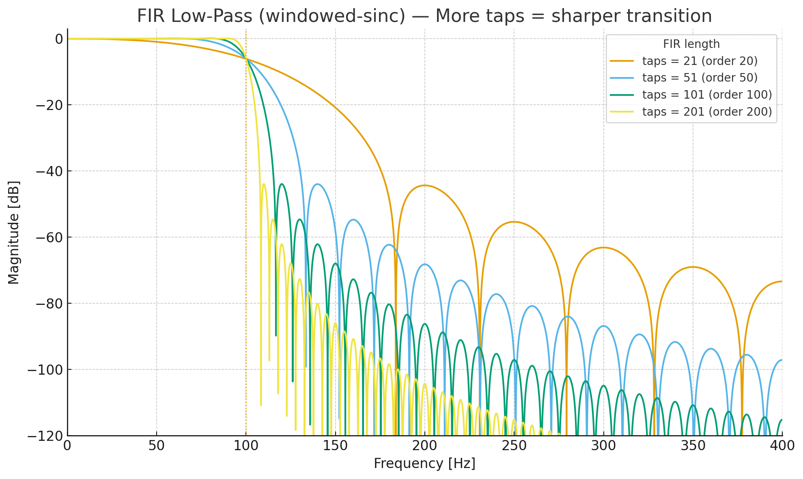

# デジタルフィルタ設計 1章

<!-- TOC -->

- [デジタルフィルタ設計 1章](#%E3%83%87%E3%82%B8%E3%82%BF%E3%83%AB%E3%83%95%E3%82%A3%E3%83%AB%E3%82%BF%E8%A8%AD%E8%A8%88-1%E7%AB%A0)
    - [前書き](#%E5%89%8D%E6%9B%B8%E3%81%8D)
    - [デジタルフィルタの種類](#%E3%83%87%E3%82%B8%E3%82%BF%E3%83%AB%E3%83%95%E3%82%A3%E3%83%AB%E3%82%BF%E3%81%AE%E7%A8%AE%E9%A1%9E)
    - [デジタルフィルタのグラフの見方](#%E3%83%87%E3%82%B8%E3%82%BF%E3%83%AB%E3%83%95%E3%82%A3%E3%83%AB%E3%82%BF%E3%81%AE%E3%82%B0%E3%83%A9%E3%83%95%E3%81%AE%E8%A6%8B%E6%96%B9)
    - [デジタルフィルタの構造の種類と特徴](#%E3%83%87%E3%82%B8%E3%82%BF%E3%83%AB%E3%83%95%E3%82%A3%E3%83%AB%E3%82%BF%E3%81%AE%E6%A7%8B%E9%80%A0%E3%81%AE%E7%A8%AE%E9%A1%9E%E3%81%A8%E7%89%B9%E5%BE%B4)
        - [種類](#%E7%A8%AE%E9%A1%9E)
        - [特徴](#%E7%89%B9%E5%BE%B4)
            - [位相](#%E4%BD%8D%E7%9B%B8)
            - [安定性](#%E5%AE%89%E5%AE%9A%E6%80%A7)
            - [Q共振の鋭さ](#q%E5%85%B1%E6%8C%AF%E3%81%AE%E9%8B%AD%E3%81%95)
            - [遷移域の狭さ](#%E9%81%B7%E7%A7%BB%E5%9F%9F%E3%81%AE%E7%8B%AD%E3%81%95)
    - [設計法選択](#%E8%A8%AD%E8%A8%88%E6%B3%95%E9%81%B8%E6%8A%9E)
        - [IIRの設計規範](#iir%E3%81%AE%E8%A8%AD%E8%A8%88%E8%A6%8F%E7%AF%84)
        - [FIRの設計規範](#fir%E3%81%AE%E8%A8%AD%E8%A8%88%E8%A6%8F%E7%AF%84)
    - [デジタルフィルタの設計手順](#%E3%83%87%E3%82%B8%E3%82%BF%E3%83%AB%E3%83%95%E3%82%A3%E3%83%AB%E3%82%BF%E3%81%AE%E8%A8%AD%E8%A8%88%E6%89%8B%E9%A0%86)
        - [FIRフィルタの設計手順](#fir%E3%83%95%E3%82%A3%E3%83%AB%E3%82%BF%E3%81%AE%E8%A8%AD%E8%A8%88%E6%89%8B%E9%A0%86)
        - [IIRフィルタの設計手順](#iir%E3%83%95%E3%82%A3%E3%83%AB%E3%82%BF%E3%81%AE%E8%A8%AD%E8%A8%88%E6%89%8B%E9%A0%86)

<!-- /TOC -->

## 前書き
研究で使うデジタルフィルタの設計を行うために最低限必要な知識をまとめたページです。 
フィルタに関して、少し理解している程度でよく分かっていないので、間違いもあると思います。ご指摘も含めよろしくお願いします。 

## デジタルフィルタの種類
* LPF(ローパスフィルタ)
  * 低周波を通して高周波をカット。
* HPF(ハイパスフィルタ)
  * 高周波を通して低周波をカット 。
* BPF(バンドパスフィルタ)
  * 〇〇Hz~△△Hzのみ通す。それ以外はカット。
* Notch Filter(ノッチフィルタ)
  * ◻︎◻︎Hzのみカット。それ以外を通す。

## デジタルフィルタのグラフの見方
図1の上図は、縦軸は大きさ(dB)、横軸は周波数(Hz)のグラフで、フィルタの特性を示しています。 
dBから振幅の大きさに変換する式は、"振幅倍率 = 10^( dB値 / 20)"です。 
つまり、0dBで1倍、-3dBで0.7079457844倍、-6dBで0.5011872336倍、-9dBで0.3548133892倍、-12dBで0.2511886432倍、...、-20dBで0.1000000000倍となります。 
カットオフ周波数とは-3dBになるところをいい、図のLPFのカットオフ周波数は20Hzとなります。
 
図1の下図は、縦軸は振幅、横軸は時間(ms)のグラフで、入力信号と出力信号の関係を示しています。
入力データは、正弦波30Hzに対し、カットオフ周波数20HzのLPFを掛けた結果です。約0.4倍の振幅になっていることが確認できます。周波数特性のグラフを確認すると、30Hzのところで-8dBです。計算してみると、" 振幅倍率 = 10^( -8 / 20) = 0.398倍 "と一致します。
 
また、今回例に挙げたフィルタでは、信号の減衰だけでなく遅延も確認できます。これは、設計によって遅延が限りなく0に近いか、どのような特徴があるかなど考慮して設計する必要があります。詳しくは後に書いてあります。

 
図1. 周波数特性と時系列グラフ

 

## デジタルフィルタの構造の種類と特徴

### 種類

* IIR (Infinite Impulse Response)
  * 出力は入力の畳み込み和だけでなく、過去の出力の畳み込み和も使って計算
* FIR (Finite Impulse Response)
  * 出力は入力の畳み込み和でのみ計算

### 特徴

#### 位相
|  | IIR (Infinite Impulse Response) | FIR (Finite Impulse Response) |
| :-- | :-: | :-: |
| 位相 | 線形になりにくい | 線形になりやすい |

今回の位相とは、周波数毎にどのくらい信号が遅延するかを示すものです。 
線形ということは、どの周波数の信号であっても遅延が一定に近いということです。逆に線形でない時は、10Hz信号は1ms出力で遅延に対し、30Hz信号は10ms出力で遅延するように一定ではないです。実際に図3を見ればわかるとおり、FIRの遅延は一定であるのに対し、IIRは一定ではないです。

 
図2. BPF(100~200Hz)の周波数特性

 

 
図3. BPF(100~200Hz)の遅延

 

#### 安定性

|  | IIR (Infinite Impulse Response) | FIR (Finite Impulse Response) |
| :-: | :-: | :-: |
| 安定性 | 設計次第 | 安定 |

これは、あまり理解できていないのですが、FIRは常に安定で、IIRの場合は|極|<1.0である時に安定するようです。図4のようなグラフを作成して、円内に収まれば安定、円外で不安定と判別できます。極を求める手順は図5の通りです。 

 
図4. zのグラフ

 

 
図5. zの求め方(ChatGPT)

 

#### Q(共振の鋭さ)

|  | IIR (Infinite Impulse Response) | FIR (Finite Impulse Response) |
| :-: | :-: | :-: |
| Q(共振の鋭さ) | 定義あり | 定義なし |

Qとは、共振の鋭さを示すもので、Q値が高いとカットオフ周波数近傍が急になります。広範囲で見ると急さは同じです。IIRの時のみ考慮します。 
図6は次数2のLPFです。Qが高いとカットオフ周波数付近で緩急が急になっていることがわかります。しかし、350Hzあたりでは、同じ値に収束しています。 
また、Q値が0.7以上になると共振しています(0dBを超えて隆起している)。これは、2次のフィルタだと共振しないQ値が0.7以下となるからです。(フィルタ毎にQ値の上限は異なります) 

 
図6. Q値

 

#### 遷移域の狭さ

|  | IIR (Infinite Impulse Response) | FIR (Finite Impulse Response) |
| :-: | :-: | :-: |
| 遷移域の狭さ | 狭くできる(特徴あり) | 狭くできる(特徴あり) |

遷移域とは、図7の周波数特性の黄色範囲部分のことを指します 
狭い遷移域をできるだけ少ない計算量・低遅延で実現したい場合、IIR（特に楕円/チェビシェフ）が有利です。 
位相直線性・波形忠実度や確実な安定性が最優先の場合FIR（equiripple/窓法）が有利です。ただしタップ数（＝遅延・計算量）が大きくなります。 
IIRで遷移域の狭くする場合、次数を増やす事で可能です。例を図8に示します。 
FIRで遷移域の狭くする場合、タップ数を増やす事で可能です。例を図9に示します。 

 
図7. 遷移域とは

 

 
図8. IIRフィルタの次数毎の周波数特性

 

 
図9. FIRフィルタの次数毎の周波数特性

 

|  | IIR (Infinite Impulse Response) | FIR (Finite Impulse Response) |
| :-: | :-: | :-: |
| 計算量 | 少ない | 多い |

##  設計法選択
フィルタの設計には、数学で定義された設計規範があります。(らしい) 
IIRでは、Butterworth、 Chebyshev、 Elliptic、 Besselなどがあります。 
FIRでは、窓法、Parks–McClellan、最小二乗、周波数サンプリング法などがあります。

###  IIRの設計規範

| 優先事項                | よく選ばれる型             | 使われる場面・コメント                      |
| ------------------- | ------------------- | -------------------------------- |
| **無難で単調（ピークなし）**    | **Butterworth**     | 音響のトーン、一般計測。“まずはコレ”。次数はやや増える     |
| **低次数で鋭い遷移域**       | **Elliptic（Cauer）** | 組込み・制御・通信の前段など。最小次数だがリップル＆位相歪みあり |
| **通過帯の平坦性より急峻さ**    | **Chebyshev I**     | パスバンド等リップルを許容。Butterより低次数        |
| **通過帯は滑らか、阻止帯で頑張る** | **Chebyshev II**    | パスバンド平坦、阻止帯等リップル。測定系で好まれることも     |
| **過渡応答/位相（群遅延）最重視** | **Bessel**          | 立上り形状を守りたい計測・オーディオ前段。超緩やか＆高次数    |

###  FIRの設計規範

| 優先事項               | よく選ばれる設計法                          | 使われる場面・コメント                      |
| ------------------ | ---------------------------------- | -------------------------------- |
| **手早く安定・直感的**      | **窓法（Kaiser が定番）**                 | 粗設計・実装容易。Kaiser βでリップルと遷移域の調整が簡単 |
| **タップ数を最小級に**      | **Parks–McClellan（Equiripple）**    | 仕様どおりのリップル/減衰で最少タップに近い。通信・計測全般   |
| **線形位相で低コスト（半帯域）** | **Half-band FIR**                  | サンプリング変換(×2/÷2)で多用。係数の半分がゼロで軽い   |
| **ISI抑制・整形**       | **(Root-)Nyquist / Raised-cosine** | 通信（送受信整形フィルタ）。群遅延一定で符号間干渉を抑制     |
| **特殊相位相器**         | **Hilbert / Differentiator**       | 90°位相器や微分器。タイプIII/IV FIR で設計     |

## デジタルフィルタの設計手順
まず、IIRか、FIRかを決めます。

### FIRフィルタの設計手順
1. 設計法(窓法, Equirippleなど)を決める
2. カットオフ周波数、必要な遷移域幅を決める
3. タップ数を決める
4. 設計コードで設計する
5. 周波数特性、遅延グラフ、時系列グラフで問題ないか確認して完成

### IIRフィルタの設計手順
1. 設計法(Butterworth, Ellipticなど)を決める
2. カットオフ周波数、必要な遷移域幅を決める
3. 次数を決める
4. 設計コードで設計する
5. 周波数特性、遅延グラフ、極のグラフ、時系列グラフで問題ないか確認して完成

Pythonライブラリでフィルタを設計すると簡単にフィルタ係数を求められるのでおすすめです。 
求めているフィルタの条件が厳しい時、ただ設計定数を入れるだけでは、フィルタが共振したり、条件を満たさない出力が出てくるので、その場合は、阻止域端最小減衰、遷移幅、通過域端などの値をいくつか与えて総当たりすることで最適なフィルタを見つけることが可能です。